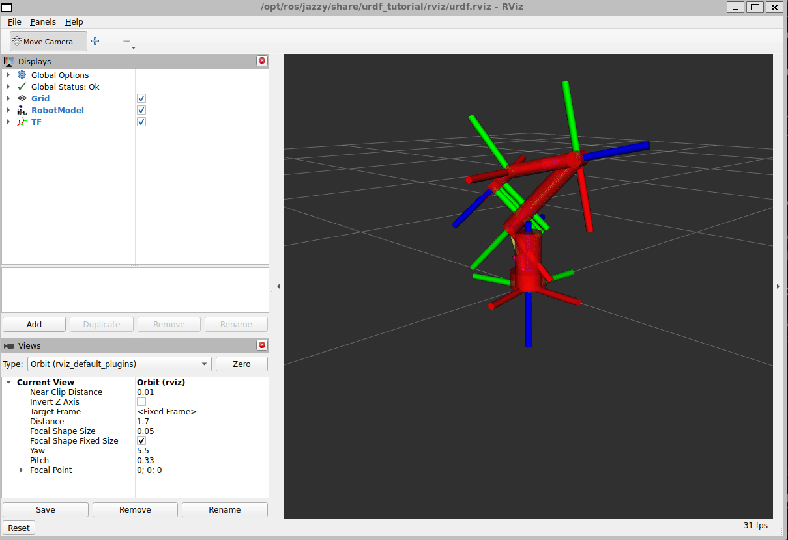

# AR4 ROS 2 Joint Controller

A ROS 2 node that drives a 6-DOF AR4 robot arm (plus gripper) with physics-based trapezoidal velocity motion profiles and streams the resulting joint states to RViz for visualization.



## Architecture

```
┌─────────────────┐   /joint_states    ┌────────────────────────┐      TF      ┌───────┐
│  arm_controller │ ─────────────────> │  robot_state_publisher │ ───────────> │ RViz  │
│   (this node)   │      50 Hz         │     (URDF → TF)        │              │       │
└─────────────────┘                    └────────────────────────┘              └───────┘
```

- **`arm_controller`** computes a trapezoidal velocity profile for each joint and publishes `sensor_msgs/JointState` on `/joint_states` at 50 Hz.
- **`robot_state_publisher`** consumes `/joint_states` and the URDF to broadcast the TF tree. The gripper's right finger is a URDF `<mimic>` of the left finger, so only the actuated left finger joint is published.
- **RViz** renders the arm from the URDF and the live TF tree.

The arm continuously oscillates between a home pose (all joints at zero) and a configurable target pose, pausing briefly at each end.

## Motion Profile

Each joint follows a **trapezoidal velocity profile**: it accelerates at a constant rate up to a maximum velocity, cruises, then decelerates to arrive at the target with zero velocity. The transition into the braking phase is decided by the kinematic stopping distance:

```
stopping_distance = v² / (2a)
```

When the remaining distance to the target is no greater than the stopping distance, the joint begins to decelerate. This profile logic was validated against an existing MATLAB Simulink baseline from a separate project.

## Quick Start

Assumes ROS 2 Jazzy is already installed and sourced.

```bash
# 1. Clone into a ROS 2 workspace's src/ directory
mkdir -p ~/ros2_ws/src
cd ~/ros2_ws/src
git clone <your-repo-url> ar4_joint_controller

# 2. Build
cd ~/ros2_ws
colcon build --packages-select ar4_joint_controller

# 3. Source and launch (controller + robot_state_publisher + RViz)
source install/setup.bash
ros2 launch ar4_joint_controller arm.launch.py
```

RViz opens and the arm oscillates between the home and target poses.

## Configuration

All runtime behavior is controlled by [`config/arm_params.yaml`](config/arm_params.yaml):

```yaml
arm_controller:
  ros__parameters:
    joint_targets: [1.57, -0.78, 1.0, 0.0, 0.5, -0.3]
    max_velocity: 1.5
    acceleration: 2.0
    publish_rate: 50.0
    gripper_target: 0.0
    dwell_time: 1.0
```

| Parameter | Units | Description |
|-----------|-------|-------------|
| `joint_targets` | rad | Target positions for `joint_1`–`joint_6`. The arm oscillates between these and the all-zero home pose. |
| `max_velocity` | rad/s | Maximum joint velocity during the cruise phase. |
| `acceleration` | rad/s² | Constant acceleration/deceleration rate. |
| `publish_rate` | Hz | Control-loop and `/joint_states` publish frequency. |
| `gripper_target` | m | Gripper opening: `0.0` = closed, `0.02` = fully open (URDF limit). |
| `dwell_time` | s | Pause at each end of the oscillation before reversing. |

## Environment

- **ROS 2 Jazzy Jalisco**
- **Ubuntu 24.04** (WSL2)
- **C++17**

## License

MIT
